# ID构件

本构件基于twitter-snowflake、leaf-segment、baidu-uid进行整合的唯一ID生成器，用于集群高并发环境下生成全局唯一ID，具备的性能：

1、高可用

2、低延迟

3、高QPS：百万级

利用该构件实现的ID获取服务在单节点上可保证单调递增，在多节点上可保证趋势递增。同时，该构件可对生成的ID进行基因混淆以隐藏原始ID。

在微服务集群中，建议基于该工具建设独立的ID服务，负责生成全局唯一标识符，让ID生成逻辑与业务逻辑解耦，使得系统更易于维护和扩展。

## 配置

```
bigbird:
  id:
    factor: # 基因因子，不设置则采用默认基因，建议采用一个比较大的数值
    enableGeneCoding: # true或者false，是否启用基因编码
    strategy: # ID生成策略，默认twitter-snowflake，具体策略对应的详细配置见对应说明
    workerId:
      strategy: zero # workerId提供策略，默认zero，具体策略对应的详细配置见对应说明
```  

## Id生成策略

1、twitter-snowflake，相关配置如下：

```
bigbird:
  id:
    strategy: snowflake
    twitter:
      workerId: # 工作机器ID（0~31）
      datacenterId: # 数据中心ID（0~31）
```

2、leaf-segment，相关配置如下：

```
bigbird:
  id:
    strategy: segment
```

3、baidu-uid，相关配置如下：

```
bigbird:
  id:
    strategy: uid
    baidu:
      timeBits: # 时间戳部分长度，与workerBits+seqBits加起来必须等于63
      workerBits: # 机器ID部分长度，与timeBits+seqBits加起来必须等于63
      seqBits: # 序列号部分长度，与workerBits+workerBits加起来必须等于63
      epochStr: # 起始日期
      boostPower: # 缓存环扩容值
      paddingFactor: # 缓存环填充UID比例
      scheduleInterval: # 缓存环定时填充周期，不配置则不启用定时填充
```

## workerId提供策略

1、固定workerId值为0，该方式遇到服务重启并且时钟回拨会产生重复ID，相关配置如下：

```
bigbird:
  id:
    workerId:
      strategy: zero
```

2、利用数据库来实现workerId的提供管理，该workerId依赖数据库自增长ID实现，用后即弃，所以每次获得的workerId都不一样，解决了因为服务重启并且时钟回拨产生重复ID的问题，但是，每次服务重启会因为workerId增加导致ID大小产生跳跃，并且对于twitter-snowflake生成策略来说很容易超过最大值31，因此仅适合baidu-uid生成策略（支持百万级数量的workerId），相关配置如下：

```
bigbird:
  id:
    workerId:
      strategy: db

spring:
  autoconfigure:
    exclude: com.alibaba.druid.spring.boot.autoconfigure.DruidDataSourceAutoConfigure
  datasource:
    druid:
      # 统计web应用请求中所有的数据库信息，比如：发出的sql语句，sql执行的时间、请求次数、请求的url地址、以及seesion监控、数据库表的访问次数等等
      web-stat-filter:
        # 启动 StatFilter
        enabled: true
        # 过滤所有url
        url-pattern: /*
        # 排除一些不必要的url
        exclusions: "*.js,*.gif,*.jpg,*.png,*.css,*.ico,/druid/*"
        # 开启session统计功能
        session-stat-enable: true
        # session的最大个数，默认100
        session-stat-max-count: 1000
      # 配置StatViewServlet（监控页面），用于展示Druid的统计信息
      stat-view-servlet:
        # 启用StatViewServlet
        enabled: true
        # 访问内置监控页面的路径，内置监控页面的首页是/druid/index.html
        url-pattern: /druid/*
        # 不允许清空统计数据，重新计算
        reset-enable: false
        # 配置监控页面访问账号和密码
        login-username: root
        login-password: passw0rd
        # 允许访问的地址，如果allow没有配置或者为空，则允许所有访问
        allow: 127.0.0.1
        # 拒绝访问的地址，deny优先于allow，如果在deny列表中，就算在allow列表中，也会被拒绝
        deny:
    dynamic:
      # 全局druid参数，单独数据源配置为空时取全局配置
      druid:
        # 配置初始化大小、最小、最大
        initial-size: 5
        max-active: 20
        min-idle: 10
        # 配置获取连接等待超时的时间（单位：毫秒）
        max-wait: 60000
        # 配置间隔多久才进行一次检测，检测需要关闭的空闲连接，单位是毫秒
        time-between-eviction-runs-millis: 300000
        # 配置一个连接在池中最小生存的时间，单位是毫秒
        min-evictable-idle-time-millis: 600000
        max-evictable-idle-time-millis: 900000
        # 用来测试连接是否可用的SQL语句，默认值每种数据库都不相同，这是mysql
        validationQuery: SELECT 1 FROM DUAL
        # 应用向连接池申请连接，并且testOnBorrow为false时，连接池将会判断连接是否处于空闲状态，如果是，则验证这条连接是否可用
        testWhileIdle: false
        # 如果为true，默认是false，应用向连接池申请连接时，连接池会判断这条连接是否是可用的
        testOnBorrow: false
        # 如果为true（默认false），当应用使用完连接，连接池回收连接的时候会判断该连接是否还可用
        testOnReturn: false
        # 是否缓存preparedStatement，也就是PSCache。PSCache对支持游标的数据库性能提升巨大，比如说oracle，在mysql下建议关闭。
        poolPreparedStatements: true
        # 要启用PSCache，必须配置大于0，当大于0时， poolPreparedStatements自动触发修改为true，
        # 在Druid中，不会存在Oracle下PSCache占用内存过多的问题，
        # 可以把这个数值配置大一些，比如说100
        max-pool-prepared-statement-per-connection-size: 20
        # 连接池中的minIdle数量以内的连接，空闲时间超过minEvictableIdleTimeMillis，则会执行keepAlive操作
        keepAlive: true
        # 缺省多个DruidDataSource的监控数据是各自独立的，在druid-0.2.17版本之后，支持配置公用监控数据
        # 合并多个DruidDataSource的监控数据
        use-global-data-source-stat: true
        # 当程序中存在没有参数化的sql执行时，sql统计的效果会不好。比如：
        # select * from t where id = 1
        # select * from t where id = 2
        # select * from t where id = 3
        # 在统计中，显示为3条sql，这不是希望要的效果。
        # StatFilter提供合并的功能，能够将这3个SQL合并为如下的SQL：
        # select * from t where id = ?
        # 可以通过connectProperties属性来打开mergeSql功能
        # 还可以通过connectProperties属性来打开慢SQL记录功能，超过3秒认为是慢sql
        connection-properties: druid.stat.mergeSql=false;druid.stat.slowSqlMillis=3000
        # 配置监控统计拦截的filters
        # stat：监控统计（必须配置，否则监控不到SQL）、slf4j：日志记录、wall：防御sql注入
        filters: stat,wall,slf4j
        # 开启druid datasource的状态监控
        stat:
          # 开启慢sql监控，超过3s就认为是慢sql，记录到日志中
          slow-sql-millis: 3000
          log-slow-sql: true
          # 关闭合并可以避免对某些sql解析错误从而提示异常
          merge-sql: false
        wall:
          # 是否允许一次执行多条语句
          multi-statement-allow: true
          # 是否进行严格的语法检测，Druid SQL Parser在某些场景不能覆盖所有的SQL语法，出现解析SQL出错，可以临时把这个选项设置为false，同时把SQL反馈给Druid的开发者。
          strictSyntaxCheck: false
        # 日志监控，使用slf4j 进行日志输出
        slf4j:
          enabled: true
          statement-executable-sql-log-enable: true
      # dynamic主从设置
      # 设置默认的数据源或者数据源组，默认值即为master
      primary: master
      # 设置严格模式，默认false不启动。启动后在未匹配到指定数据源时候会抛出异常，不启动会使用默认数据源。
      strict: false
      datasource:
        master:
          url: jdbc:p6spy:mysql://localhost:3306/uuid?createDatabaseIfNotExist=true&useUnicode=true&characterEncoding=utf8&character_set_server=utf8mb4&zeroDateTimeBehavior=convertToNull&useSSL=true&serverTimezone=GMT%2B8
          username: root
          password: ENC(VZamSTMi224AH6RUtJGXNldiDp/XEL2ozRhBUu/o9ChodT4JEb9kE/j0EFhXKbjsfvLVacUW0AUzetA6OrNJug==)
          driver-class-name: com.p6spy.engine.spy.P6SpyDriver
          type: com.alibaba.druid.pool.DruidDataSource
          # 此处可以单独设置数据源的durid配置
          durid:
            initial-size: 5
  flyway:
    # 是否启用flyway，由于支持多数据源，这里设置为false
    enabled: false
    # 编码格式，默认UTF-8
    encoding: UTF-8
    # 迁移sql脚本文件名称的前缀，默认V
    sql-migration-prefix: V
    # 迁移sql脚本文件名称的分隔符，默认2个下划线__
    sql-migration-separator: __
    # 迁移sql脚本文件名称的后缀
    sql-migration-suffixes: .sql
    # 迁移时是否进行校验，默认true
    validate-on-migrate: true
    # 当迁移发现数据库非空且存在没有元数据的表时，自动执行基准迁移，新建schema_version表
    baseline-on-migrate: true
    # 禁止flyway执行清理
    clean-disabled: true
    # 用于记录所有的版本变化记录
    table: flyway_schema_history

decorator:
  datasource:
    p6spy:
      logging: custom
      custom-appender-class: wang.bigbird.domain.framework.data.mybatisplus.dynamic.support.logger.MyFormattedLogger

mybatis-plus:
  mapper-locations: classpath*:mappers/*.xml
```

3、利用zookeeper来实现workerId的提供管理，对于同一个IP+Port的服务来说，即使服务重启也可以再次使用上一次分配的workerId，可实现workerId固定不变，同时在获取workerId过程中对时钟回拨问题进行处理，相关配置如下：

```
bigbird:
  id:
    workerId:
      strategy: zk
      interval: # 心跳间隔时间，单位：毫秒
      pidHome: # 本地workerID文件存储根路径 
      pidPort: # 使用端口（同机多uid应用时区分端口）
  data:
    zookeeper:
      addresses:  # 节点地址，逗号分隔
      namespace: # 命名空间
      sessionTimeout: # 会话超时时间，单位：毫秒，默认5秒
      connectTimeout: # 连接超时，单位：毫秒，默认5秒
      retry:
        type: # 重连策略，枚举值，默认以指数级延迟的重连模式
        retryTime: # 重连间隔时间，以秒为单位，默认1秒
        maxSleepTime: # 最大重连间隔时间，以秒为单位，默认30秒
        maxRetries: # 最大重连次数，默认10次
        retryUntilElapsed: # 总等待时间，以秒为单位，默认10秒
      authentication:
        type: # 认证策略，枚举值，默认任何客户端都可以访问
        username: # 认证用户名
        password: # 认证密码
```

4、利用redis来实现workerId的提供管理，对于同一个IP+Port的服务来说，即使服务重启也可以再次使用上一次分配的workerId，可实现workerId固定不变，同时在获取workerId过程中对时钟回拨问题进行处理，相关配置如下：

```
bigbird:
  id:
    workerId:
      strategy: redis
      interval: # 心跳间隔时间，单位：毫秒
      pidHome: # 本地workerID文件存储根路径 
      pidPort: # 使用端口（同机多uid应用时区分端口）
  data:
    redis:
      addresses:  # 节点地址，逗号分隔
      password: # 密码
      database: # 库编号（单机版可用）
      timeout: # 命令等待超时，单位：毫秒
      connectTimeout: # 连接超时，单位：毫秒
      connectionPoolSize: # 节点连接池大小
      connectionMinimumIdleSize: # 节点最小空闲连接数
```

## 服务启动重用worker id时，对时钟回拨的处理流程

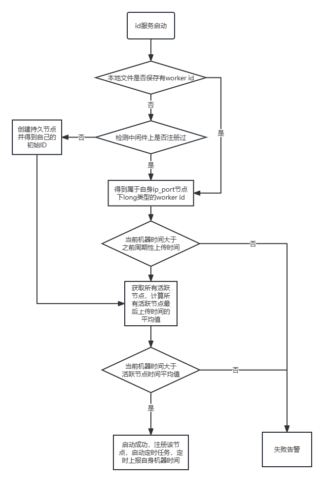

## 闰秒

为确定时间，世界上有两种常用的时间计量系统：基于地球自转的世界时（UT）和基于原子振荡周期的国际原子时（TAI）。

世界时：基于地球自转的天文测量而得出，由于地球自转的不稳定（由地球物质分布不均匀和其它星球的摄动力等引起的）会带来时间的差异。

原子时：以原子振荡周期确定，相对恒定不变。

由于两种测量方法不同，随着时间推移，两个计时系统结果会出现差异，一般来说一至二年会差大约1秒时间，因此有了协调世界时的概念。

协调世界时以国际原子时秒长为基础，在时刻上尽量接近世界时。1972年的国际计量大会决定，当国际原子时与世界时的时刻相差达到0.9秒时，协调世界时就增加或减少1秒，以尽量接近世界时，这个修正被称作闰秒。

## 算法解读

### twitter-snowflake

基于Twitter [snowflake](https://github.com/twitter/snowflake) 的生成算法。

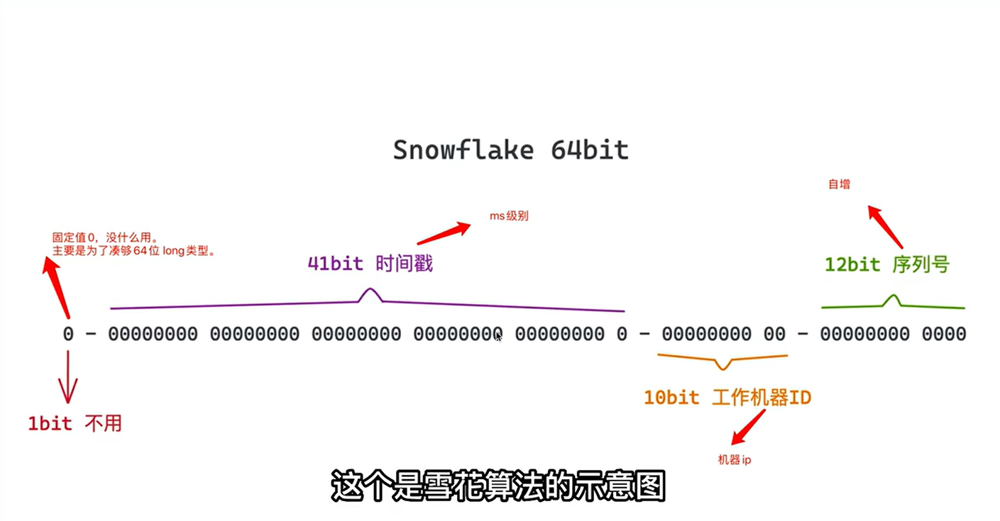

第一个部分：1个bit。无意义，固定为0。二进制中最高位是符号位，1表示负数，0表示正数。ID都是正整数，所以固定为0。

第二个部分：41个bit。表示时间戳，带有自增属性，精确到毫秒，可以使用69年，即：(2^41-1) / (1000 * 60 * 60 * 24 *365) = 69年。

第三个部分：10个bit。表示10位的机器标识，最多支持1024个节点。此部分也可拆分成5位datacenterId和5位workerId，datacenterId表示机房ID，workerId表示机器ID。

第四个部分：12个bit。表示序列化，即一些列的自增ID，可以支持同一节点同一毫秒生成最多4096个（2的12次方）ID序号。那么单台工作机器一秒支持生成4096000个ID，满足了每秒百万级。

缺点：依赖机器时钟，如果机器上的时钟回拨，会导致重复或服务不可用的问题。

本构件提供的twitter-snowflake，优化了闰秒回拨处理，新增默认workId与datacenterId的提供方法。

### leaf-segment

基于美团 [leaf-segment](https://github.com/Meituan-Dianping/Leaf) 的生成算法。

数据库表设计如下：

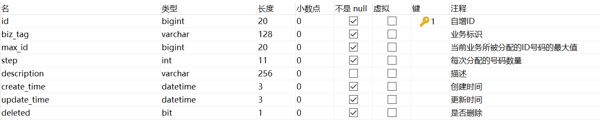

对应数据库表脚本：uuid.sql --> td_leaf_alloc

重要字段说明：

biz_tag用来区分业务，每个biz_tag的ID获取相互隔离，互不影响。

max_id表示该biz_tag目前所被分配的ID号段的最大值。

step表示每次分配的号段数量。

其生成ID的获取过程如下：

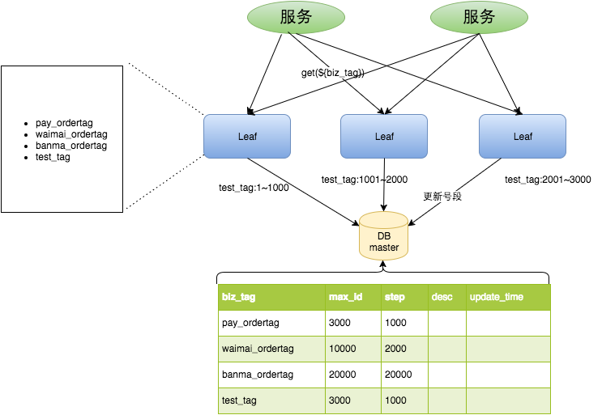

test_tag在第一台Leaf机器上是1~1000的号段，当这个号段用完时，会去加载另一个长度为step=1000的号段。假设另外两台号段都没有更新，这个时候第一台机器新加载的号段就应该是3001~
4000。同时，数据库对应的biz_tag这条数据的max_id会从3000被更新成4000。

leaf号段加载时机，如下：

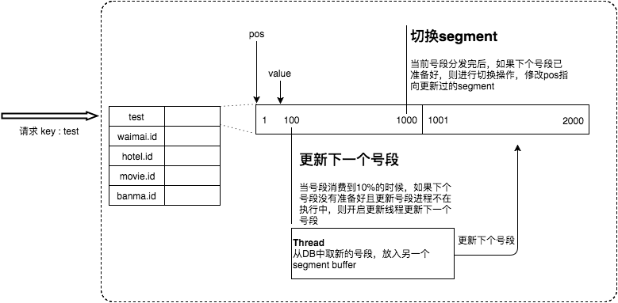

采用双buffer的方式，Leaf服务内部有两个号段缓存区segment。当前号段已下发10%时，如果下一个号段未更新，则另启一个更新线程去更新下一个号段。当前号段全部下发完后，如果下个号段准备好了则切换到下个号段为当前segment接着下发，循环往复。

优点：由于不包含时间戳信息，因此不存在时钟回拨问题。

缺点：强依赖数据库，DB宕机会造成整个系统不可用并且生成ID号码不够随机，能够泄露发号数量的信息，不太安全。

本构件提供的leaf-segment，仅保留了美团的双buffer优化的实现方案。

备注：本构件未搜录美团 [leaf](https://tech.meituan.com/MT_Leaf.html) 中的leaf-snowflake方案 [原因详述](https://note.youdao.com/s/DLkVzXiW)
。

### baidu-uid

基于百度 [UidGenerator](https://github.com/baidu/uid-generator) 的生成算法。

百度对Snowflake的组成部分稍微调整了一下：

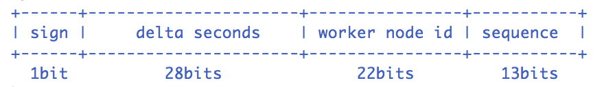

* sign (1 bit)
  固定1bit符号标识，即生成的UID为正数。
* delta seconds (28 bits)
  当前时间，相对于时间基点"2016-05-20"的增量值，单位：秒，最多可支持约8.5年，即：(2^28-1) / (60 * 60 * 24 *365) = 8.5年。
* worker node id (22 bits)
  机器id，最多可支持约420w（即2^22-1）次机器启动。内置实现为在启动时由数据库分配，默认分配策略为用后即弃，后续可提供复用策略。
* sequence (13 bits)
  每秒下的并发序列，13 bits可支持每秒8192个并发。但是，通过消费未来时间，baidu-uid突破了这里的性能限制。

当然，根据业务的需求，UidGenerator可以适当调整delta seconds、worker node id和sequence占用位数。

数据库表设计如下：

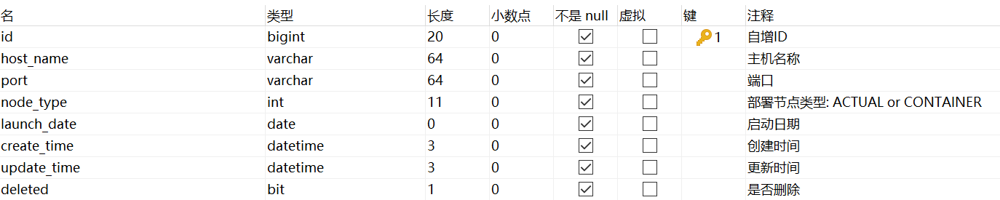

对应数据库表脚本：uuid.sql --> td_worker_node

重要说明：

UidGenerator会在集成用它生成分布式ID的实例启动的时候，往这个表中插入一行数据，得到的id值就是准备赋给worker node id的值。

#### RingBuffer环形数组

数组每个元素成为一个slot。RingBuffer容量，默认为Snowflake算法中sequence最大值，且为2^N。可通过```boostPower```配置进行扩容，以提高RingBuffer读写吞吐量。

CachedUidGenerator采用了双RingBuffer，一个Uid-RingBuffer用于保存唯一ID，一个Flag-RingBuffer用于存储Uid状态（是否可填充、是否可消费）。

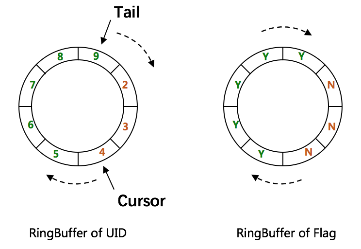

#### RingBuffer Of Flag

其中，保存flag这个RingBuffer的每个slot的值都是0或者1，0是CAN_PUT_FLAG的标志位，1是CAN_TAKE_FLAG的标识位。每个slot的状态要么是CAN_PUT，要么是CAN_TAKE。以某个slot的值为例，初始值为0，即CAN_PUT。接下来会初始化填满这个RingBuffer，这时候这个slot的值就是1，即CAN_TAKE。等获取分布式ID时取到这个slot的值后，这个slot的值又变为0，以此类推。

#### RingBuffer Of UID

保存唯一ID的RingBuffer有两个指针，Tail指针和Cursor指针。Tail指针、Cursor指针用于环形数组上读写slot：

* Tail指针  
  指向最后一个生成的唯一ID，表示Producer生产的最大序号（此序号从0开始，持续递增）。Tail不能超过Cursor，即生产者不能覆盖未消费的slot。当Tail已赶上Cursor，意味着RingBuffer已经满了。这时候，不允许再继续生成ID了。此时可通过```rejectedPutBufferHandler```
  指定PutRejectPolicy。
* Cursor指针  
  指向最后一个已经给消费的唯一ID，表示Consumer消费到的最小序号（序号序列与Producer序列相同）。Cursor不能超过Tail，即不能消费未生产的slot。当Cursor已赶上Tail，意味着RingBuffer已经空了。这时候，不允许再继续获取ID了。此时可通过```rejectedTakeBufferHandler```
  指定TakeRejectPolicy。

由于数组元素在内存中是连续分配的，可最大程度利用CPU cache以提升性能。但同时会带来「伪共享」 [FalseSharing问题](https://note.youdao.com/s/310Z3Mkj)
，为此，在Tail、Cursor指针、Flag-RingBuffer中采用了CacheLine补齐方式。

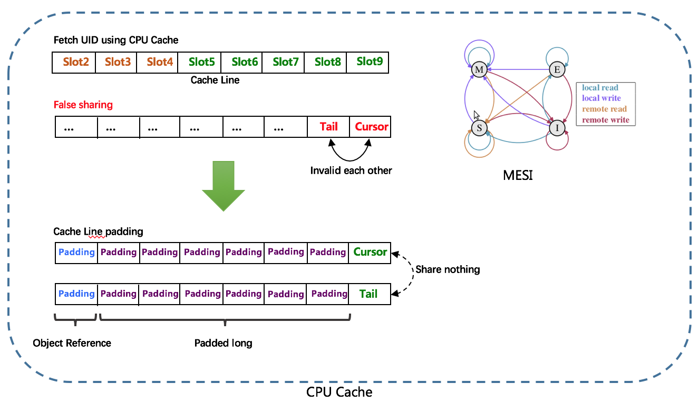

#### RingBuffer填充时机

* 初始化预填充  
  RingBuffer初始化时，预先填充满整个RingBuffer。
* 即时填充  
  Take消费时，即时检查剩余可用slot量(```tail``` - ```cursor```)，如小于设定阈值，则补全空闲slots。阈值可通过```paddingFactor```来进行配置。
* 周期填充  
  通过Schedule线程，定时补全空闲slots。可通过```scheduleInterval```配置，以应用定时填充功能，并指定Schedule时间间隔。

#### 关于UID比特分配的建议

对于并发数要求不高、期望长期使用的应用，可增加```timeBits```位数，减少```seqBits```
位数。例如，节点采取用完即弃的WorkerIdAssigner策略，重启频率为12次/天，那么，配置成```{"workerBits":23,"timeBits":31,"seqBits":9}```时，可支持持续运行(2^31-1)
/ (60 * 60 * 24 *365) = 68年，满足(2^23-1) / (12 * 365 * 68) = 28个节点，达到整体并发量 2^9 * 28 = 14336 UID/s的速度。

对于节点重启频率频繁、期望长期使用的应用，可增加```workerBits```和```timeBits```位数，减少```seqBits```位数。例如，节点采取用完即弃的WorkerIdAssigner策略，重启频率为24*
12次/天，那么，配置成```{"workerBits":27,"timeBits":30,"seqBits":6}```时，可支持持续运行(2^30-1) / (60 * 60 * 24 *365) = 34年，满足(2^27-1)
/ (12 * 24 * 365 * 34) = 37个节点，达到整体并发量 2^6 * 37 = 2368 UID/s的速度。

#### 吞吐量测试

在MacBook Pro（2.7GHz Intel Core i5，8G DDR3）上进行了CachedUidGenerator（单实例）的UID吞吐量测试。

首先固定住workerBits为任选一个值（如20），分别统计timeBits变化时（如从25至32，总时长分别对应1年和136年）的吞吐量，如下表所示：

|timeBits|25|26|27|28|29|30|31|32|
|:---:|:---:|:---:|:---:|:---:|:---:|:---:|:---:|:---:|
|throughput|6,831,465|7,007,279|6,679,625|6,499,205|6,534,971|7,617,440|6,186,930|6,364,997|

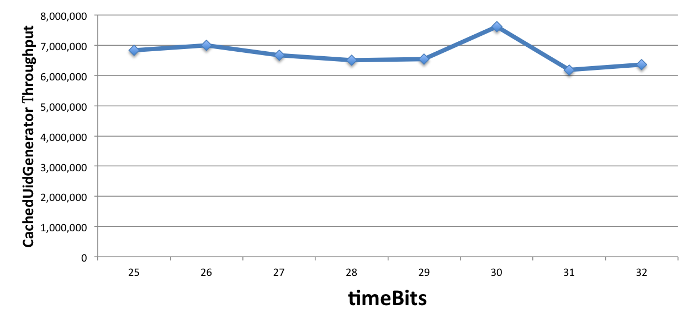

再固定住timeBits为任选一个值（如31），分别统计workerBits变化时（如从20至29，总重启次数分别对应1百万和500百万）的吞吐量，如下表所示：

|workerBits|20|21|22|23|24|25|26|27|28|29|
|:---:|:---:|:---:|:---:|:---:|:---:|:---:|:---:|:---:|:---:|:---:|
|throughput|6,186,930|6,642,727|6,581,661|6,462,726|6,774,609|6,414,906|6,806,266|6,223,617|6,438,055|6,435,549|

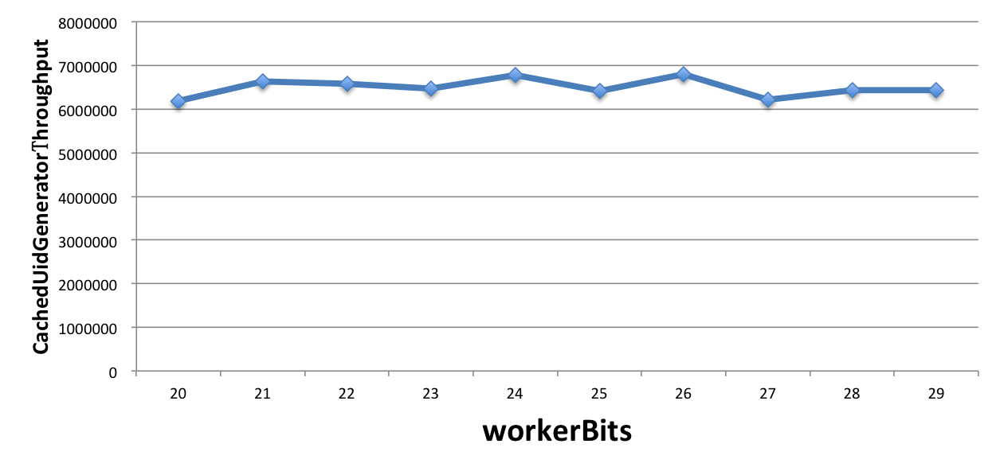

最后，固定住workerBits和timeBits位数（如23和31），分别统计不同数目（如1至8，本机CPU核数为4）的UID使用者情况下的吞吐量，如下表所示：

|workerBits|1|2|3|4|5|6|7|8|
|:---:|:---:|:---:|:---:|:---:|:---:|:---:|:---:|:---:|
|throughput|6,462,726|6,542,259|6,077,717|6,377,958|7,002,410|6,599,113|7,360,934|6,490,969|

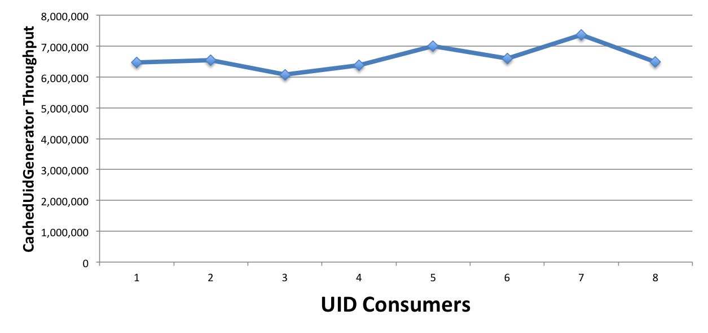

由此可见，不管如何配置，CachedUidGenerator总能提供**600万/s**的稳定吞吐量。

优点：非常适合虚拟环境，比如：Docker。通过消费未来时间克服了雪花算法的并发限制，压测结果显示单个实例的QPS能超过6000,000。另外，UidGenerator的时间类型是AtomicLong且通过incrementAndGet()方法获取下一次的时间（可能是未来时间），从而脱离了对服务器时间的依赖，也就不会有时钟回拨的问题。

缺点：强依赖数据库，DB宕机会造成整个系统不可用。分布式ID中的时间信息并不是这个ID真正产生的时间点。

## 构件依赖

MybatisPlus构件、Redis构件、Zookeeper构件。
