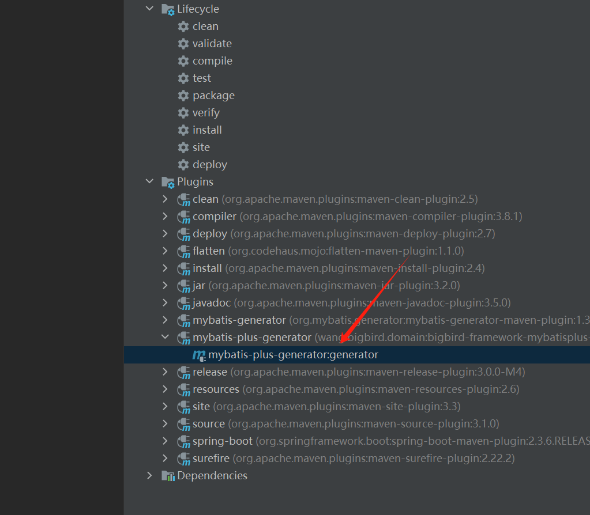

# MybatisPlus代码生成插件

## 安装插件

下载开发框架，在该模块的项目工程中，执行`mvn intall`。

## 在pom中引入插件

在要使用插件的工程pom文件中引入该插件。

```xml
<build>
    <plugins>
        <plugin>
            <groupId>wang.bigbird.domain</groupId>
            <artifactId>bigbird-framework-mybatisplus-generator-maven-plugin</artifactId>
        </plugin>
    </plugins>
</build>
```

## 修改配置文件

配置文件路径：${basedir}/src/main/resources/generator/mp-code-generator-config.yaml

```yaml
globalConfig:
  # 代码作者，替换为具体作者名称
  author: Bigbird
  open: false
  idType: INPUT
  dateType: ONLY_DATE
  enableCache: false
  activeRecord: false
  baseResultMap: true
  baseColumnList: true
  swagger2: false
  fileOverride: true
dataSourceConfig:
  # 数据库连接信息，替换为具体数据库连接信息，建议加上时区
  url: jdbc:mysql://localhost:3306/demo?useUnicode=true&characterEncoding=utf8&zeroDateTimeBehavior=convertToNull&useSSL=true&serverTimezone=GMT%2B8
  driverName: com.mysql.jdbc.Driver
  username: root
  password: root
packageConfig:
  # 顶层包路径，根据具体项目替换为对应包路径
  parent: wang.bigbird.domain.demo
  # 模块名称，根据具体项目替换为对应模块名称
  # 作用与context-path类似，会放置到接口路径中，因此建议设置为空
  moduleName: 
  # 实体子包路径
  entity: domain.entity
  # service接口子包路径
  service: service.db
  # service实现类子包路径
  serviceImpl: service.db.impl
  # mapper类子包路径
  mapper: dao
  # mapper配置文件子包路径
  xml: mappers
  # 接口子包路径
  controller: controller
  pathInfo:
    # 实体包完整路径，根据具体项目替换为对应路径
    entity_path: src/main/java/wang/bigbird/domain/demo/domain/entity
    # service接口包完整路径，根据具体项目替换为对应路径
    service_path: src/main/java/wang/bigbird/domain/demo/service/db
    # service实现类包完整路径，根据具体项目替换为对应路径
    service_impl_path: src/main/java/wang/bigbird/domain/demo/service/db/impl
    # mapper类包完整路径，根据具体项目替换为对应路径
    mapper_path: src/main/java/wang/bigbird/domain/demo/dao
    # 接口包完整路径，根据具体项目替换为对应路径
    controller_path: src/main/java/wang/bigbird/domain/demo/controller
    # mapper配置文件完整路径
    xml_path: src/main/resources/mappers
strategyConfig:
  naming: underline_to_camel
  columnNaming: underline_to_camel
  entityLombokModel: true
  superEntityClass: wang.bigbird.domain.framework.data.mybatisplus.dynamic.domain.entity.BaseEntity
  superEntityColumns:
    - id
    - create_time
    - update_time
    - deleted
  superMapperClass: wang.bigbird.domain.framework.data.mybatisplus.dynamic.dao.BaseMapper
  superServiceClass: wang.bigbird.domain.framework.data.mybatisplus.dynamic.service.base.IService
  superServiceImplClass: wang.bigbird.domain.framework.data.mybatisplus.dynamic.service.db.impl.AbstractServiceImpl
  controllerMappingHyphenStyle: true
  restControllerStyle: true
  # 指定数据库表名的前缀，当实体类名与数据库表名存在固定的前缀差异时，可借助该配置自动完成映射，无需在每个实体类上单独添加@TableName注解。
  # 表名：t_user → 对应的实体类名：User，可通过配置 tablePrefix = "t_" 让MyBatis-Plus自动完成映射，无需额外配置。
  tablePrefix:
    - td_
    - tr_
  # 要自动生成代码的数据表列表
  include:
    - td_user
```

## 运行maven命令

在命令工具中，进入到要生成项目的根目录（即pom.xml目录），执行以下命令。

```shell
mvn mybatis-plus-generator:generator
```

如果是使用IntelliJ IDEA工具，可直接选择项目依赖插件，双击执行对应命令。


